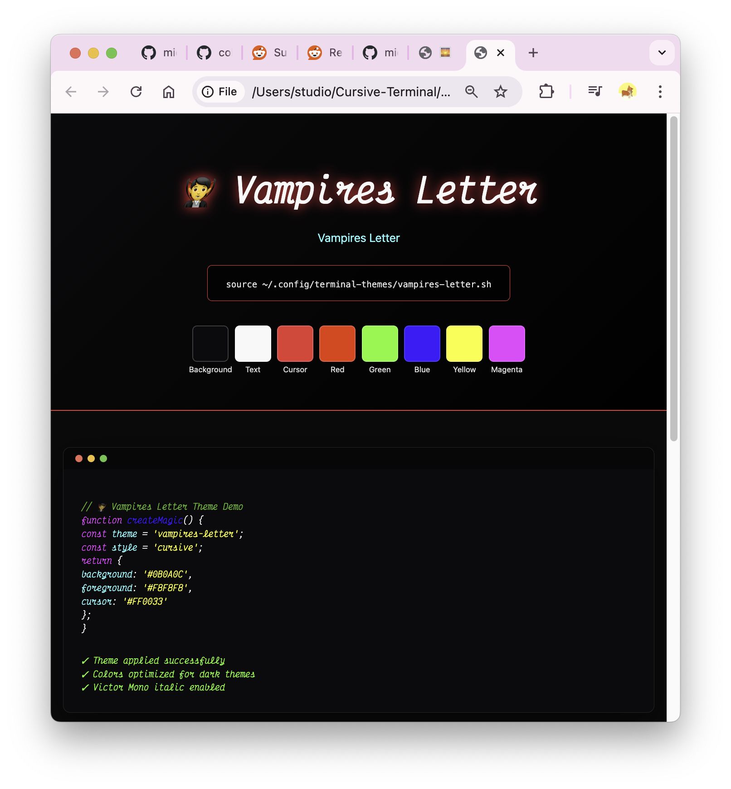
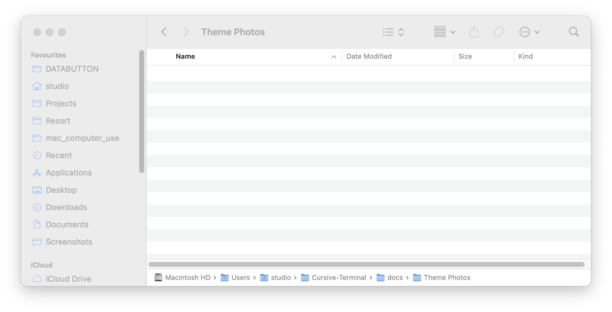
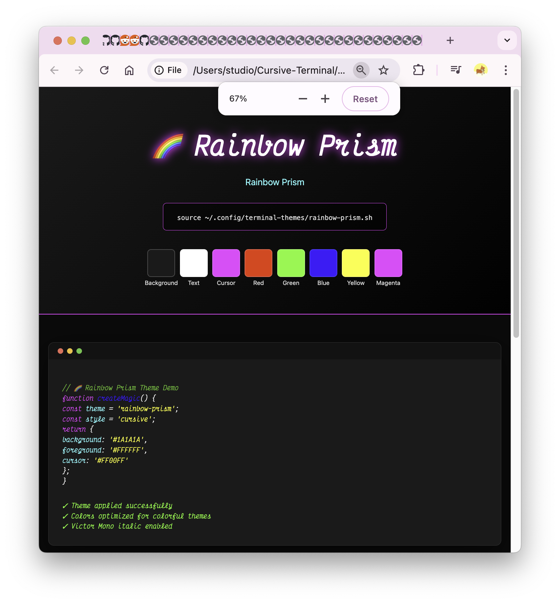
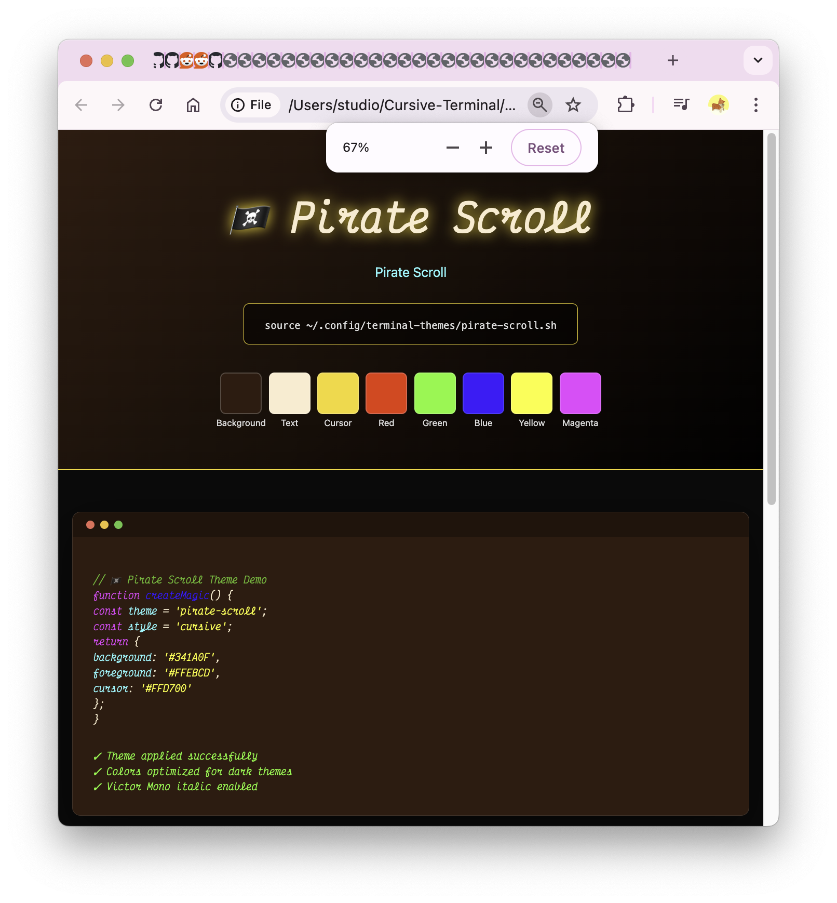
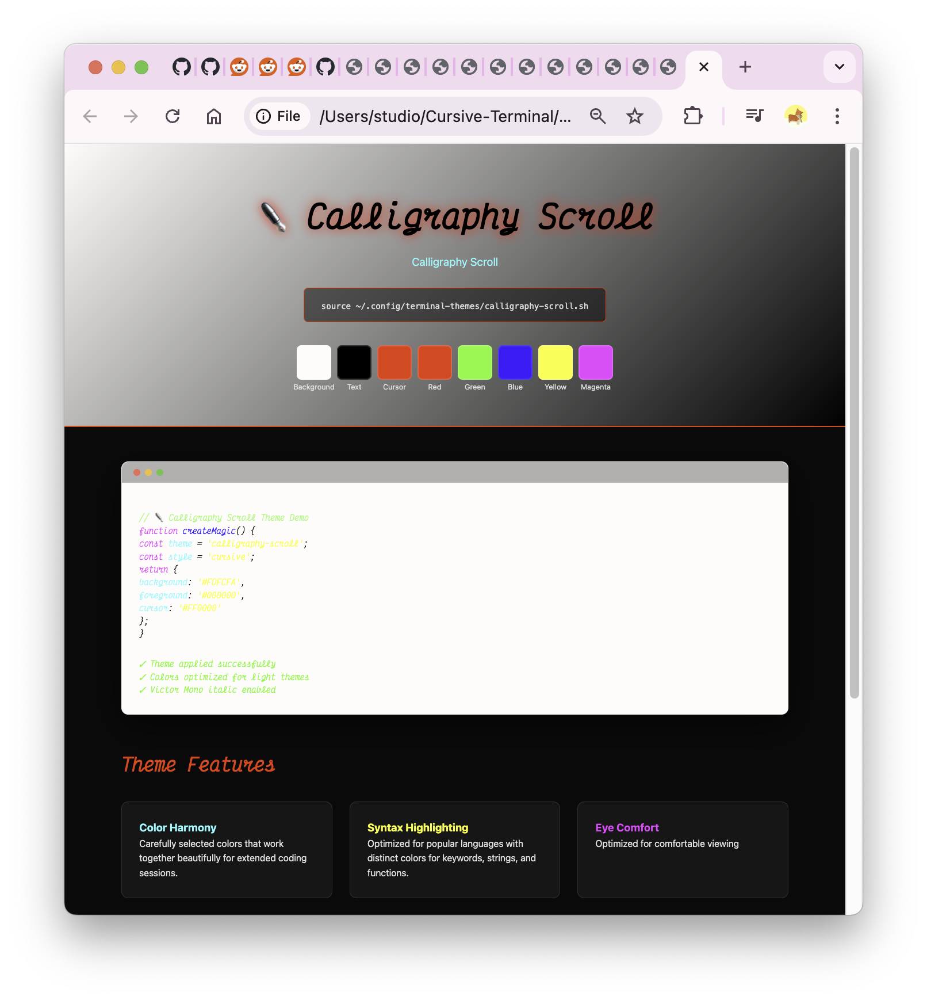
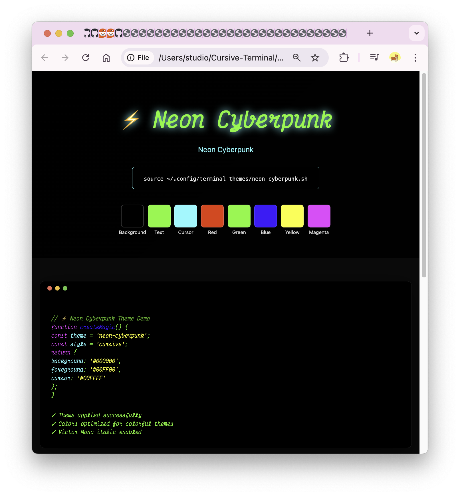

# Add this section after Features in README.md:

## 🎨 33 Beautiful Themes

Transform your terminal with our collection of 33 hand-crafted cursive themes. Each theme is carefully designed for comfort and beauty.

<div align="center">

### ✨ Featured Themes

| Dark Themes | Light Themes | Colorful Themes |
|:-----------:|:------------:|:---------------:|
|  |  |  |
| **🧛 Vampire's Letter** | **📜 Ancient Papyrus** | **🌈 Rainbow Prism** |
| Dark velvet & blood red | Aged manuscript feel | Vibrant rainbow syntax |
|  |  |  |
| **🏴‍☠️ Pirate Scroll** | **✒️ Calligraphy Scroll** | **⚡ Neon Cyberpunk** |
| Weather-beaten parchment | Classic black on cream | Matrix-style neon green |

### 🌟 Theme Categories

- **Dark Themes (9)**: Perfect for late-night coding sessions
- **Light Themes (6)**: Manuscript-inspired for bright environments  
- **Colorful Themes (6)**: Vibrant colors for creative coding
- **Business Themes (6)**: Professional document styles
- **WCAG-AA Themes (6)**: High contrast, accessibility-focused

</div>

### 🚀 Quick Theme Install

```bash
# Install all 33 themes
./scripts/install-all-themes.sh

# Launch interactive theme selector
./scripts/theme-selector.sh

# Or apply a theme directly
source ~/.config/terminal-themes/vampires-letter.sh
```

### 🎯 Interactive Theme Selector

Our theme selector makes it easy to browse and preview all themes:

```
Main Menu:
  1) All Themes (33)
  2) Dark Themes (9)
  3) Light Manuscript (6)
  4) Colorful Themes (6)
  5) Business Documents (6)
  6) Feather-Light WCAG (6)

  s) Search themes
  r) Random theme
  p) Toggle preview mode
  q) Quit
```

**[🎨 Browse Full Theme Gallery →](https://midnightnow.github.io/Cursive-Terminal/themes/)**

---