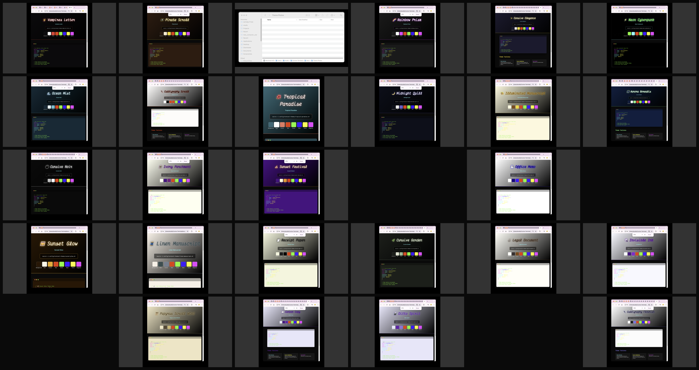
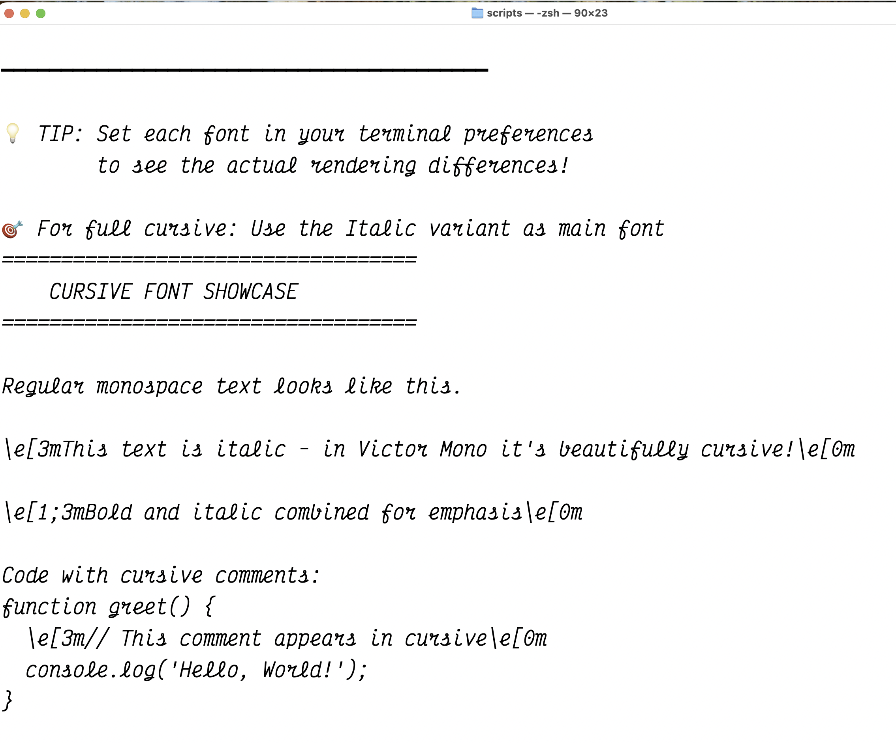
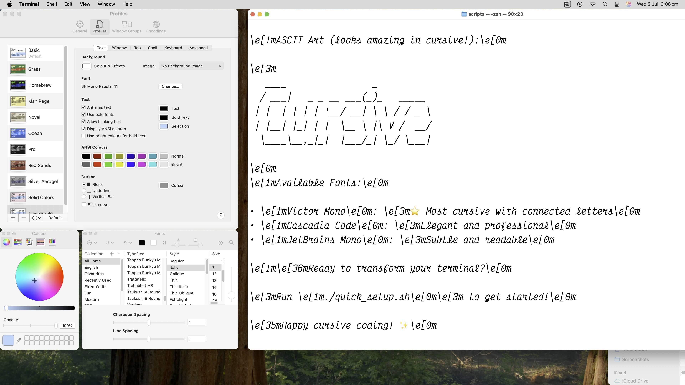
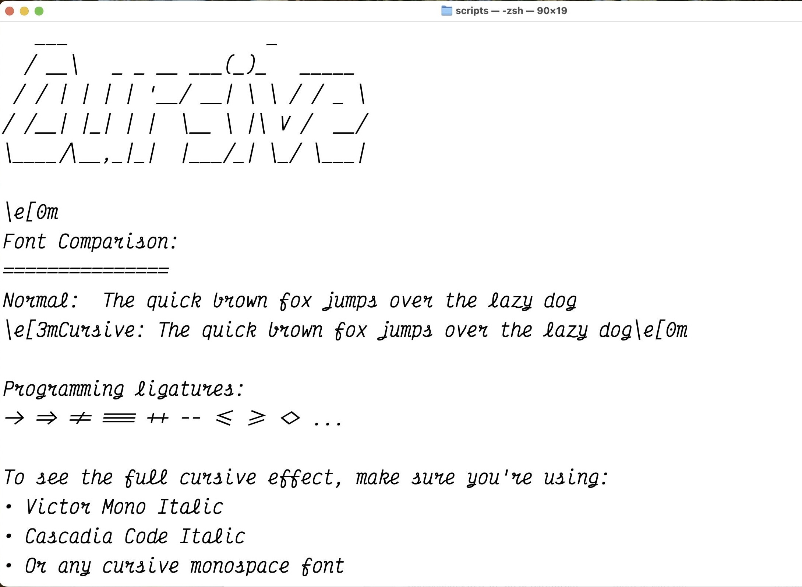
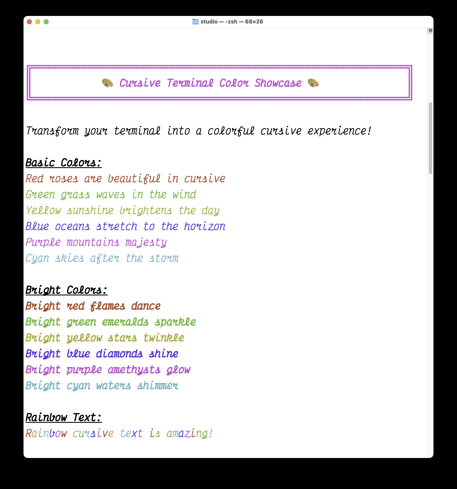
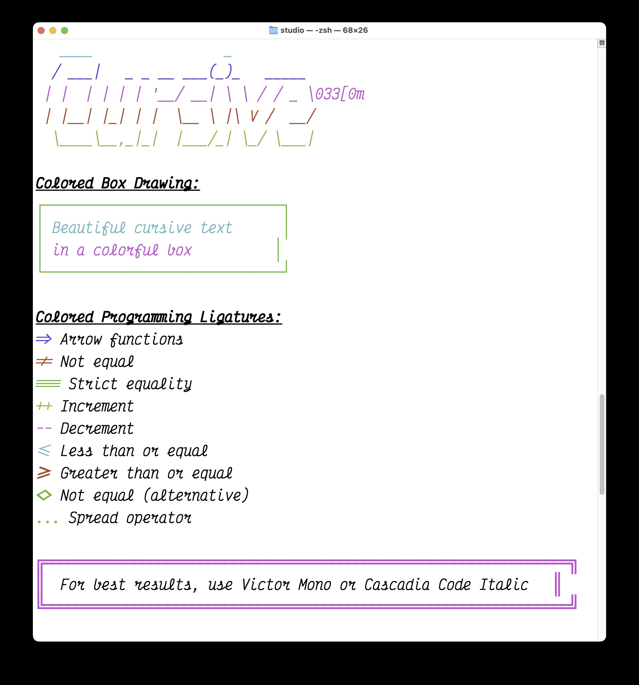
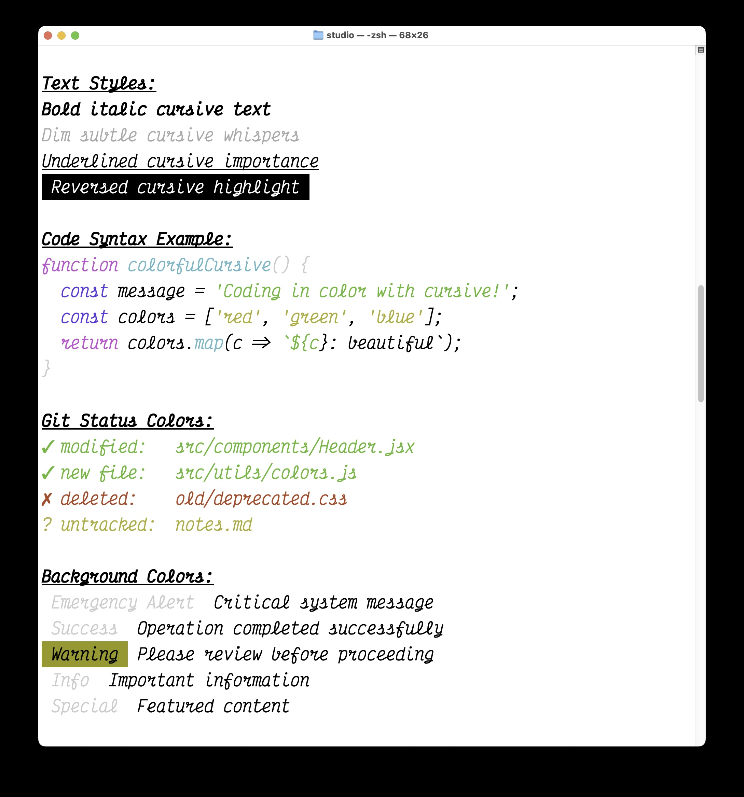
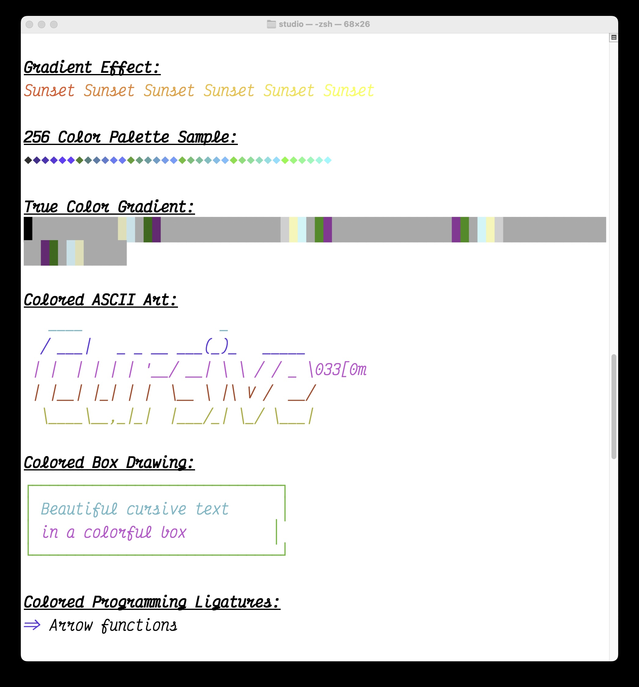

# ✒️ Cursive Terminal Setup

<div align="center">

[](LICENSE)
[](https://www.apple.com/macos/)
[](#terminal-setup)
[](#recommended-fonts)
[](CONTRIBUTING.md)

*Transform your boring monospace terminal into a beautiful cursive writing experience!*



**[Quick Start](#-quick-start) • [Font Gallery](docs/FONT_GALLERY.md) • [Contributing](CONTRIBUTING.md) • [Troubleshooting](TROUBLESHOOTING.md)**

</div>

## 🎨 What is this?

This repository contains everything you need to set up a **fully cursive terminal** on macOS. Imagine coding in elegant, flowing script while maintaining perfect monospace alignment!

## ✨ Features

- **33 Beautiful Themes**: From Vampire's Letter to Ancient Papyrus
- **5+ Cursive Monospace Fonts**: Victor Mono, Cascadia Code, JetBrains Mono, and more
- **Interactive Theme Selector**: Browse, preview, and apply themes instantly
- **Visual Font Gallery**: PNG previews showing each font's cursive style
- **Animated Showcase**: GIF demonstrations of cursive terminal in action
- **Enhanced Syntax Highlighting**: Make comments and strings extra beautiful
- **Font Generation Tools**: Create your own oblique/cursive variants
- **Complete Configuration**: iTerm2 profiles, Neovim configs, and more
- **Professional Setup**: Full installation script and MIT license

## 🎨 33 Beautiful Themes

Transform your terminal with our collection of 33 hand-crafted cursive themes. Each theme is carefully designed for comfort and beauty.

<div align="center">

### ✨ Featured Themes

| Dark Themes | Light Themes | Colorful Themes |
|:-----------:|:------------:|:---------------:|
|  |  |  |
| **🧛 Vampire's Letter** | **📜 Ancient Papyrus** | **🌈 Rainbow Prism** |
| Dark velvet & blood red | Aged manuscript feel | Vibrant rainbow syntax |

### 🌟 Theme Categories

- **Dark Themes (9)**: Perfect for late-night coding sessions
- **Light Themes (6)**: Manuscript-inspired for bright environments  
- **Colorful Themes (6)**: Vibrant colors for creative coding
- **Business Themes (6)**: Professional document styles
- **WCAG-AA Themes (6)**: High contrast, accessibility-focused

[**🎨 Browse All 33 Themes →**](https://midnightnow.github.io/Cursive-Terminal/themes/)

</div>

## 🚀 Quick Start

```bash
# Clone this repository
git clone https://github.com/midnightnow/Cursive-Terminal.git
cd Cursive-Terminal

# Install all 33 themes
./scripts/install-all-themes.sh

# Launch interactive theme selector
./scripts/theme-selector.sh

# Or try a specific theme
source ~/.config/terminal-themes/vampires-letter.sh
```

## 📦 What's Included

```
cursive-terminal-setup/
├── scripts/
│   ├── cursive_font_demo.sh         # Demo script showing cursive features
│   ├── colored_text_demo.sh         # Colorful text demo with cursive fonts
│   ├── font_comparison.sh           # Compare different cursive fonts
│   ├── showcase.sh                  # Animated feature showcase
│   ├── font_preview_generator.py    # Generate font preview images
│   ├── showcase_gif_generator.sh    # Create animated GIF demos
│   ├── license_generator.sh         # Generate MIT license
│   └── create_oblique_font.py       # Create custom slanted fonts
├── themes/
│   └── cursive_terminal_themes.sh   # Beautiful terminal color themes
├── configs/
│   ├── cursive_iterm_profile.json   # iTerm2 profile with cursive settings
│   ├── cursive_neovim_config.lua    # Neovim configuration for cursive
│   └── starship.toml                # Starship prompt with cursive styling
├── docs/
│   ├── images/                      # Font previews and demo GIFs
│   └── FONT_GALLERY.md             # Visual font comparison gallery
├── install.sh                       # Complete installation script
└── LICENSE                          # MIT license
```

## 🎯 Recommended Fonts

### Victor Mono (⭐ Most Cursive)
The star of the show! Features beautiful semi-connected cursive italics.
```bash
brew install font-victor-mono
```

### Other Great Options
- **Cascadia Code**: Microsoft's elegant cursive italics
- **JetBrains Mono**: Subtle cursive for long coding sessions
- **Fira Code**: Not cursive, but amazing ligatures

## 🖥️ Terminal Setup

### For Terminal.app
1. Press `⌘,` to open preferences
2. Go to Profiles → Text
3. Change font to "Victor Mono" → "Italic"

### For iTerm2
1. Press `⌘,` to open preferences
2. Go to Profiles → Text → Font
3. Select "Victor Mono Italic"
4. Or import our custom profile: `configs/cursive_iterm_profile.json`

## 🌈 Usage Examples

### Test Cursive Rendering
```bash
echo -e "Regular text \e[3mThis appears in beautiful cursive!\e[0m"
```

### Full Cursive Mode
Set Victor Mono Italic as your main terminal font to make EVERYTHING cursive!

## 📸 Screenshots

### Font Showcase

*Beautiful cursive fonts in action*

### ASCII Art Display

*ASCII art looks amazing in cursive fonts*

### Font Comparison

*Side-by-side comparison of cursive fonts*

### Colored Text Demo

*Colorful text rendering with cursive fonts*


*Colored ASCII art in cursive*


*Various text styles and colors*


*Beautiful color effects and gradients*

<details>
<summary>View code examples in cursive</summary>

### Code Comments in Cursive
```javascript
// This comment appears in beautiful flowing script
const message = "Even strings can be cursive!";
```

### Git Output
Git commands show metadata in elegant cursive italics.

### Man Pages
Manual pages render with cursive emphasis for readability.

</details>

## 🛠️ Advanced Setup

### Generate Font Previews
Create visual comparisons of all cursive fonts:
```bash
# Requires: pip install Pillow
python scripts/font_preview_generator.py
```

### Create Animated Demo
Generate a showcase GIF for your repository:
```bash
# Requires: brew install asciinema && cargo install --git https://github.com/asciinema/agg
./scripts/showcase_gif_generator.sh
```

### Create Your Own Oblique Font
```bash
python scripts/create_oblique_font.py /path/to/font.ttf output.ttf
```

### Custom Themes
Apply beautiful color themes optimized for cursive:
```bash
source themes/cursive-elegance.sh
source themes/cursive-noir.sh
source themes/cursive-garden.sh
```

## 🤝 Contributing

Found a new cursive monospace font? Have a beautiful theme? PRs welcome!

We love contributions! Please read our [Contributing Guide](CONTRIBUTING.md) to get started.

### Quick Contribution Ideas
- 🔤 Add support for new cursive fonts
- 🎨 Create new terminal themes
- 📚 Improve documentation
- 🐛 Fix bugs and issues
- 🎬 Create demo videos or GIFs

## 📋 Changelog

See [CHANGELOG.md](CHANGELOG.md) for detailed release notes and version history.

## 📝 License

This project is licensed under the MIT License - see the [LICENSE](LICENSE) file for details.

## 🙏 Acknowledgments

### Fonts
- **[Victor Mono](https://rubjo.github.io/victor-mono/)** by Rune Bjørnerås
- **[Cascadia Code](https://github.com/microsoft/cascadia-code)** by Microsoft
- **[JetBrains Mono](https://www.jetbrains.com/lp/mono/)** by JetBrains
- **[Fira Code](https://github.com/tonsky/FiraCode)** by Nikita Prokopov

### Tools & Inspiration
- Terminal emulator developers for excellent font rendering
- The typography community for beautiful monospace fonts
- Developers who value aesthetics in their tools

---

<div align="center">

**⚡ Fun Fact**: You're joining an elite group of developers who code entirely in cursive! Welcome to the club! ✨

*Made with ❤️ and a love for beautiful typography*

**[⭐ Star this repo](../../stargazers) if it made your terminal beautiful!**

</div>