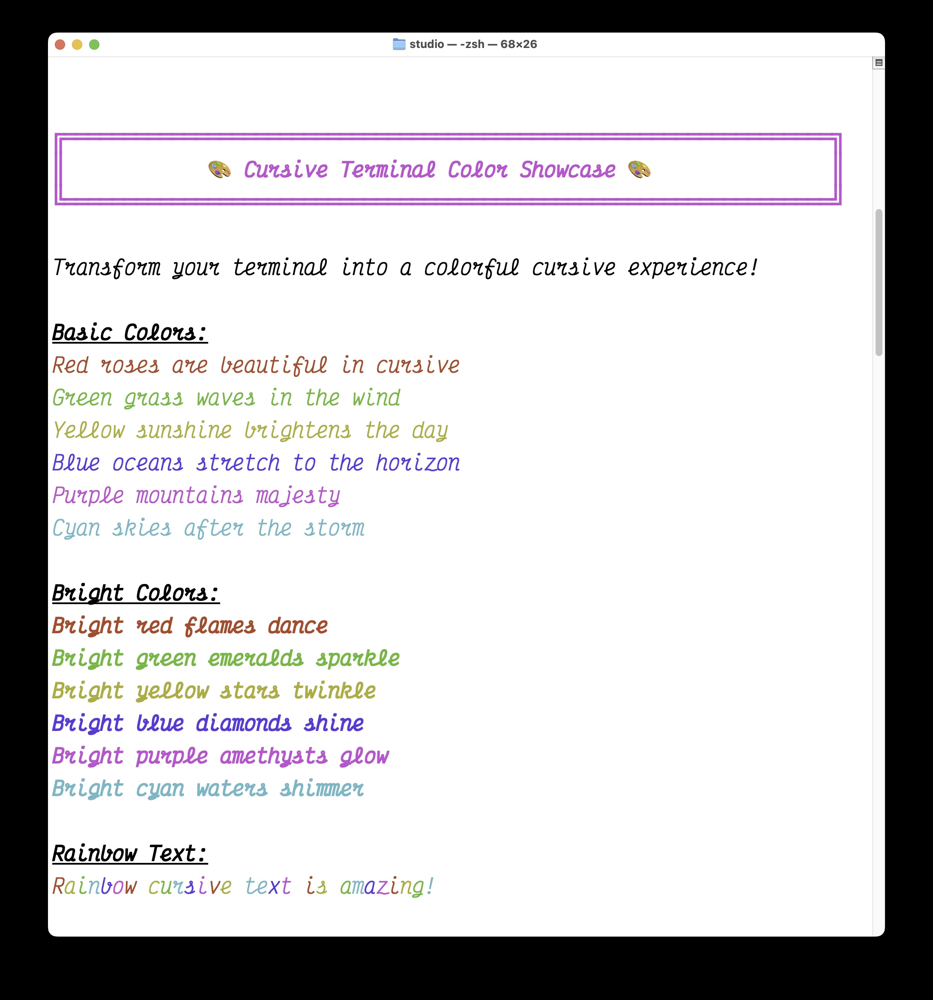
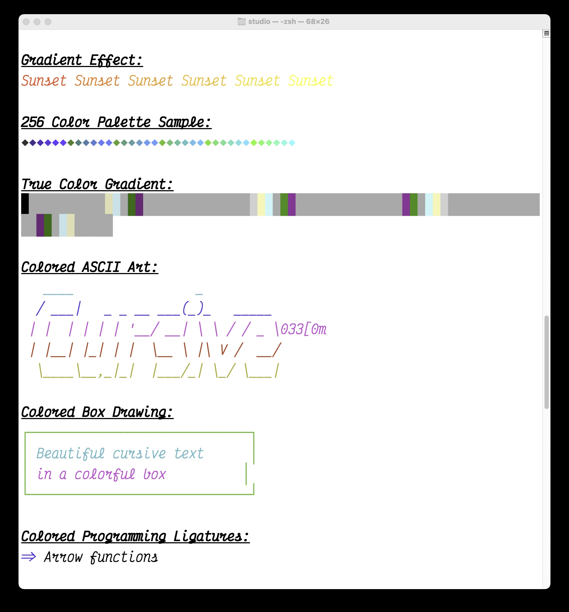

# ✒️ Cursive Terminal - 33 Beautiful Themes for Elegant Coding

<div align="center">

[](LICENSE)
[](https://www.apple.com/macos/)
[](#terminal-setup)
[](#theme-gallery)
[](#recommended-fonts)
[](https://github.com/sponsors/midnightnow)

*Transform your boring monospace terminal into a beautiful cursive writing experience with 33 stunning themes!*


**[Quick Start](#-quick-start) • [33 Themes](#-theme-gallery) • [Support Us](#-support-this-project) • [Gallery](docs/FONT_GALLERY.md)**

</div>

## 🎨 What is this?

The **ultimate collection** of cursive terminal themes and fonts for macOS. Code in elegant, flowing script with 33 professionally designed color themes - from elegant manuscripts to cyberpunk neon!

## ✨ Features

- **🎨 33 Beautiful Themes**: Dark, light, colorful, business, and manuscript-inspired
- **✍️ 5+ Cursive Monospace Fonts**: Victor Mono, Cascadia Code, JetBrains Mono, and more
- **🌈 Theme Categories**:
  - 9 Dark themes (Elegance, Noir, Vampire's Letter...)
  - 6 Light manuscript themes (Ancient Papyrus, Royal Parchment...)
  - 6 Colorful themes (Rainbow Prism, Neon Cyberpunk...)
  - 6 Business document themes (Office Memo, Blueprint Tech...)
  - 6 Feather-light WCAG-AA compliant themes
- **🚀 One-Click Installation**: Simple scripts for instant beauty
- **📸 Visual Previews**: See every theme before you choose
- **🛠️ Professional Tools**: Theme selector, font generator, and more
- **♿ Accessibility**: WCAG-AA compliant light themes included

## 💝 Support This Project

Love coding in cursive? Support the development of new themes and features!

### Ways to Support:
- **[GitHub Sponsors](https://github.com/sponsors/midnightnow)** - Monthly support with perks
- **[Buy Me a Coffee](https://buymeacoffee.com/midnightnow)** - One-time donations
- **[PayPal](https://paypal.me/midnightnow)** - Quick tips
- **Bitcoin**: `bc1qxxxxxxxxxxxxxxxxxxxxxxxxxxxxxxxx`
- **Ethereum**: `0xXXXXXXXXXXXXXXXXXXXXXXXXXXXXXXXX`

### Sponsor Perks:
- 🌟 Early access to new themes
- 🎨 Custom theme requests
- 📱 Priority support
- 🏆 Sponsor badge in contributors list

## 🚀 Quick Start

```bash
# Clone this repository
git clone https://github.com/midnightnow/Cursive-Terminal.git
cd Cursive-Terminal

# Run the quick setup (installs all 33 themes!)
./quick_setup.sh

# Launch the interactive theme selector
./scripts/theme-selector.sh

# Test cursive fonts
./scripts/cursive_font_demo.sh
```

## 📦 What's Included

```
cursive-terminal-setup/
├── scripts/
│   ├── cursive_font_demo.sh         # Demo script showing cursive features
│   ├── colored_text_demo.sh         # Colorful text demo with cursive fonts
│   ├── font_comparison.sh           # Compare different cursive fonts
│   ├── showcase.sh                  # Animated feature showcase
│   ├── font_preview_generator.py    # Generate font preview images
│   ├── showcase_gif_generator.sh    # Create animated GIF demos
│   ├── license_generator.sh         # Generate MIT license
│   └── create_oblique_font.py       # Create custom slanted fonts
├── themes/
│   └── cursive_terminal_themes.sh   # Beautiful terminal color themes
├── configs/
│   ├── cursive_iterm_profile.json   # iTerm2 profile with cursive settings
│   ├── cursive_neovim_config.lua    # Neovim configuration for cursive
│   └── starship.toml                # Starship prompt with cursive styling
├── docs/
│   ├── images/                      # Font previews and demo GIFs
│   └── FONT_GALLERY.md             # Visual font comparison gallery
├── install.sh                       # Complete installation script
└── LICENSE                          # MIT license
```

## 📚 Documentation

Comprehensive guides for users and developers:

- **[README.md](README.md)** - This file! Main project overview
- **[SCRIPTS_REFERENCE.md](SCRIPTS_REFERENCE.md)** - Complete guide to all 40+ scripts
- **[DEVELOPMENT.md](DEVELOPMENT.md)** - Developer contribution guide
- **[WORK_LOG.md](WORK_LOG.md)** - Detailed development session logs
- **[SESSION_TRACKER.md](SESSION_TRACKER.md)** - Quick session reference
- **[CONTRIBUTING.md](CONTRIBUTING.md)** - How to contribute
- **[CHANGELOG.md](CHANGELOG.md)** - Version history
- **[TROUBLESHOOTING.md](TROUBLESHOOTING.md)** - Common issues and solutions
- **[docs/FONT_GALLERY.md](docs/FONT_GALLERY.md)** - Visual font comparison

## 🎯 Recommended Fonts

### Victor Mono (⭐ Most Cursive)
The star of the show! Features beautiful semi-connected cursive italics.
```bash
brew install font-victor-mono
```

### Other Great Options
- **Cascadia Code**: Microsoft's elegant cursive italics
- **JetBrains Mono**: Subtle cursive for long coding sessions
- **Fira Code**: Not cursive, but amazing ligatures

## 🖥️ Terminal Setup

### For Terminal.app
1. Press `⌘,` to open preferences
2. Go to Profiles → Text
3. Change font to "Victor Mono" → "Italic"

### For iTerm2
1. Press `⌘,` to open preferences
2. Go to Profiles → Text → Font
3. Select "Victor Mono Italic"
4. Or import our custom profile: `configs/cursive_iterm_profile.json`

## 🌈 Usage Examples

### Test Cursive Rendering
```bash
echo -e "Regular text \e[3mThis appears in beautiful cursive!\e[0m"
```

### Full Cursive Mode
Set Victor Mono Italic as your main terminal font to make EVERYTHING cursive!

## 📸 Screenshots

### Font Showcase

*Beautiful cursive fonts in action*

### ASCII Art Display

*ASCII art looks amazing in cursive fonts*

### Font Comparison

*Side-by-side comparison of cursive fonts*

### Colored Text Demo

*Colorful text rendering with cursive fonts*


*Colored ASCII art in cursive*


*Various text styles and colors*


*Beautiful color effects and gradients*

<details>
<summary>View code examples in cursive</summary>

### Code Comments in Cursive
```javascript
// This comment appears in beautiful flowing script
const message = "Even strings can be cursive!";
```

### Git Output
Git commands show metadata in elegant cursive italics.

### Man Pages
Manual pages render with cursive emphasis for readability.

</details>

## 🛠️ Advanced Setup

### Generate Font Previews
Create visual comparisons of all cursive fonts:
```bash
# Requires: pip install Pillow
python scripts/font_preview_generator.py
```

### Create Animated Demo
Generate a showcase GIF for your repository:
```bash
# Requires: brew install asciinema && cargo install --git https://github.com/asciinema/agg
./scripts/showcase_gif_generator.sh
```

### Create Your Own Oblique Font
```bash
python scripts/create_oblique_font.py /path/to/font.ttf output.ttf
```

## 🎨 Theme Gallery

### Dark Themes (9)
```bash
# Elegant dark themes for focused coding
source ~/.config/terminal-themes/cursive-elegance.sh    # Purple/Gold elegance
source ~/.config/terminal-themes/cursive-noir.sh        # Black/Silver sophistication
source ~/.config/terminal-themes/pirate-scroll.sh       # Brown/Gold adventure
source ~/.config/terminal-themes/vampires-letter.sh     # Black/Red gothic
source ~/.config/terminal-themes/ocean-mist.sh          # Blue/Teal serenity
source ~/.config/terminal-themes/midnight-quill.sh      # Indigo/Silver mystery
```

### Light Manuscript Themes (6)
```bash
# Professional light themes inspired by classic manuscripts
source ~/.config/terminal-themes/ancient-papyrus.sh      # Cream/Brown classic
source ~/.config/terminal-themes/royal-parchment.sh      # Ivory/Purple royalty
source ~/.config/terminal-themes/calligraphy-master.sh   # White/Black precision
source ~/.config/terminal-themes/illuminated-manuscript.sh # Gold/Cream luxury
```

### Colorful Themes (6)
```bash
# Vibrant themes for creative coding sessions
source ~/.config/terminal-themes/rainbow-prism.sh        # Full spectrum colors
source ~/.config/terminal-themes/neon-cyberpunk.sh       # Neon green/pink future
source ~/.config/terminal-themes/tropical-paradise.sh    # Teal/Coral beach vibes
source ~/.config/terminal-themes/cotton-candy.sh         # Pink/Purple sweetness
```

### Business Document Themes (6)
```bash
# Professional themes for work environments
source ~/.config/terminal-themes/office-memo.sh          # Navy/White corporate
source ~/.config/terminal-themes/blueprint-tech.sh       # Blueprint blue technical
source ~/.config/terminal-themes/legal-document.sh       # Brown/White formal
```

### Feather-Light Themes (6) - WCAG-AA Compliant
```bash
# High-contrast light themes for accessibility
source ~/.config/terminal-themes/papyrus-scroll.sh       # Ochre/Brown (5.21:1)
source ~/.config/terminal-themes/linen-sheet.sh          # White/Charcoal (7.89:1)
source ~/.config/terminal-themes/calligraphy-flourish.sh # Pearl/Black (19.56:1)
source ~/.config/terminal-themes/invisible-ink.sh        # Easter egg theme!
```

### Interactive Theme Selector
```bash
# Can't decide? Use our interactive selector!
./scripts/theme-selector.sh
```

## 🤝 Contributing

Found a new cursive monospace font? Have a beautiful theme? PRs welcome!

We love contributions! Please read our [Contributing Guide](CONTRIBUTING.md) to get started.

### Quick Contribution Ideas
- 🔤 Add support for new cursive fonts
- 🎨 Create new terminal themes
- 📚 Improve documentation
- 🐛 Fix bugs and issues
- 🎬 Create demo videos or GIFs

## 📋 Changelog

See [CHANGELOG.md](CHANGELOG.md) for detailed release notes and version history.

## 📝 License

This project is licensed under the MIT License - see the [LICENSE](LICENSE) file for details.

## 🙏 Acknowledgments

### Fonts
- **[Victor Mono](https://rubjo.github.io/victor-mono/)** by Rune Bjørnerås
- **[Cascadia Code](https://github.com/microsoft/cascadia-code)** by Microsoft
- **[JetBrains Mono](https://www.jetbrains.com/lp/mono/)** by JetBrains
- **[Fira Code](https://github.com/tonsky/FiraCode)** by Nikita Prokopov

### Tools & Inspiration
- Terminal emulator developers for excellent font rendering
- The typography community for beautiful monospace fonts
- Developers who value aesthetics in their tools

---

<div align="center">

**⚡ Fun Fact**: You're joining an elite group of developers who code entirely in cursive! Welcome to the club! ✨

*Made with ❤️ and a love for beautiful typography*

**[⭐ Star this repo](../../stargazers) if it made your terminal beautiful!**

</div>